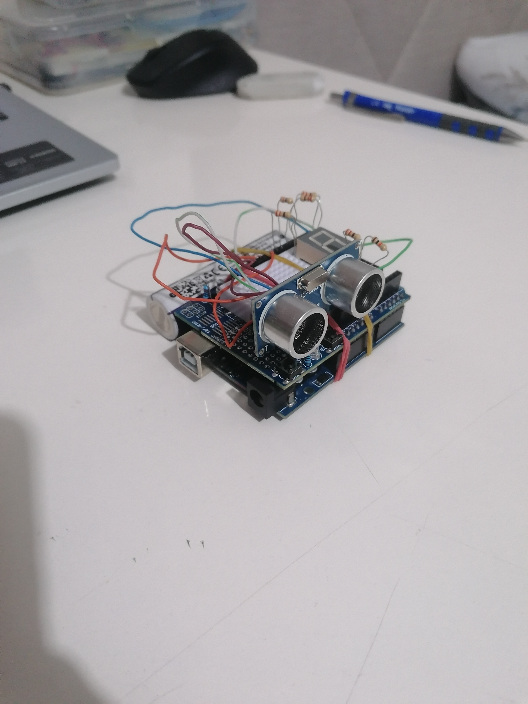
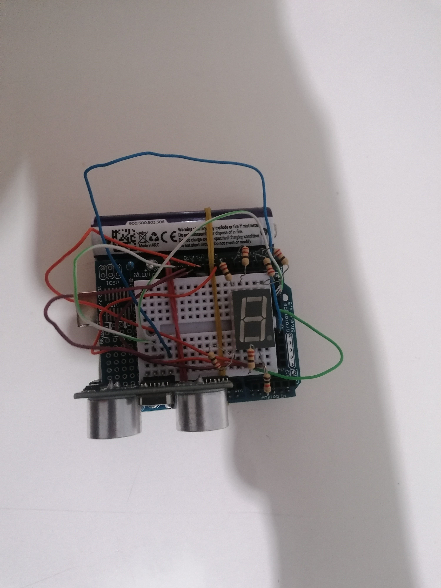

# \# Digital Ruler

# 

# An Arduino-based digital ruler project using an ultrasonic distance sensor.

# 

# \## About The Project

# 

# Digital Ruler is a simple distance measurement device built with Arduino.

# The project uses an HC-SR04 ultrasonic sensor to measure distance and displays the result on a single digit 7-segment display.

# 

# \## Components Used

# 

# \- Arduino Board

# \- HC-SR04 Ultrasonic Distance Sensor

# \- Single Digit 7-Segment Display

# \- Arduino Prototype Shield

# \- Jumper Wires

# \- Electronic Components

# 

# \## Features

# 

# \- Ultrasonic distance measurement

# \- Real-time distance display

# \- Compact prototype design

# \- Arduino controlled system

# 

# \## Hardware Setup

# 

# The HC-SR04 sensor measures the distance by sending ultrasonic waves and calculating the return time of the echo signal.

# 

# The measured value is processed by Arduino and displayed on the 7-segment display.

# 

# \## Software

# 

# \- Arduino IDE

# \- C/C++ (Arduino Programming Language)

# 

# \## Files

# 

# \- `dijital-cetvel.ino` - Main Arduino source code

# 

# \## Installation

# 

# 1\. Open the project with Arduino IDE.

# 2\. Connect the components according to the circuit.

# 3\. Upload `dijital-cetvel.ino` to your Arduino board.

# 4\. Power the system and start measuring distances.

# 

# \## Future Improvements

# 

# Possible improvements:

# \- Multi-digit display support

# \- Better measurement accuracy

# \- Battery-powered version

# \- Enclosure design

# 

# \## License

# 

# This project is shared for educational and development purposes.

## Project Photos

